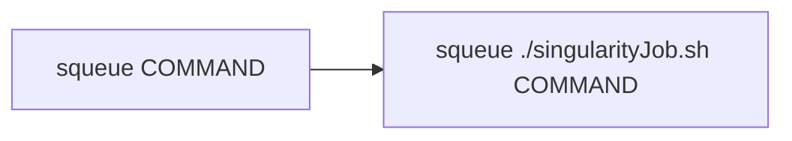
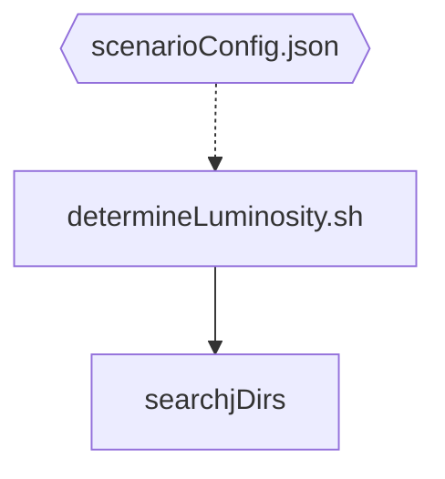

# LuminosityFit

Note: For future development I would recommend to port the necessary code python and perform all needed operations in tensorflow, numpy and pandas. This will reduce the repo size and improve the UX and DX dramatically. Also when using tensorflow many features like running on gpus ship out of the box. Performance improvements can also be expected.

## Installation

### Prerequisites

Make sure your Pandaroot enviroment is set up correctly, more precisely that these environment variables are set:

- SIMPATH
- VMCWORKDIR
- FAIRROOTPATH
- ROOTSYS

Boost and the gsl library are two requirements, which are automatically included with fairsoft, so you already have them installed for sure. It is recommended to use the same boost, which was used to build the pandaroot enviroment. Use the _BOOST_ROOT_ environment variable to hint cmake to correct boost location.
`export BOOST_ROOT=$SIMPATH`
(No need to put that export in your bashrc, just run it in your shell before cmake call)

### Compilation

Simply create a build directory, change into that build directory, and run `cmake {PATH_TO_YOUR_LUMINOSITY_FIT_SOURCE}`

## Using

The binaries in the `./bin` subdirectory of the build path can be used directly. For more convenient use, especially for larger datasamples sizes it is recommended to use the python scripts in the [./scripts](https://github.com/spflueger/LuminosityFit/tree/master/scripts) subdirectory. However, to use these scripts several environment variables have to be exported.

```bash
export LMDFIT_BUILD_PATH="path-to-your-luminosityfit-build-directory"   # e.g. $HOME/LuminosityFit/build
export LMDFIT_SCRIPTPATH="path-to-your-luminosityfit-script-directory"  # e.g. $HOME/LuminosityFit/python
export DATA_HOME="path-to-himspecf-data-storage"`
export LMDFIT_DATA_DIR=$DATA_HOME/paluma/"directory-name-of-your-choice"
```

In order to have the full ROOT cling support, export the build library directory location to the LD_LIBRARY_PATH.

```bash
export LD_LIBRARY_PATH=$LD_LIBRARY_PATH:$LMDFIT_BUILD_PATH/lib
```

## Using in Container with the Slurm Agent

Start the agent with:

```bash
module load lang/Python/3.9.6-GCCcore-11.2.0
python/lumifit/agent.py
```

It will run in the background and wait for json-formatted `SlurmOrder`s in the named pipe `/tmp/lmdfitpipe`. After it receives an order and executes it, it returns a json-formatted `SlurmOrder` to the same pipe (and blocks if no-one receives it!).

To exit the agent, pipe the exit meta-command to the pipe:

```bash
echo '{"orderType": "meta", "cmd": "exit"}' > /tmp/lmdfit
```

Start container (pipe in `/tmp` is automatically available in Singularity):

```bash
module load tools/Singularity
singularity run lmdfit-mini.sif
```

In there, run the test simulation:

```bash
python python runSimulationReconstruction.py simparams.conf recoparams.conf
```

# Mode of Operation

The luminosity extraction can only happen if one or multiple Lumi_TrksQA files are available (For now, a Lumi_Params file must also be present, I don't know yet what's in this file. It's created during MC generation step, but we don't have MC data in the actual experiment).

The LumiFit software then performs multiple individual steps, many of them on a cluster via slurm job.

1. Lumi_TrkQA files are already there
   - Determine IP Position from them
   - determine (or read?) total cross section and save to file
2. Now, two things happen at the same time (they are independent of each other):
   - With that IP position, apply xy and momentum cuts on tracks. That is a complete reco chain! This is done with DPM, just like the MC data gen.
     - copy Lumi_Params and Lumi_Digi from previous simulation
     - run reco, erecomerge, track find, track fit macros again
     - then, run trackFilter macro (this is the actual cut)
     - then, back propagation and Lumi_TrkQA again
   - The second thing is resolution and acceptance simulation, so have a realistic detector model
     - this is done with the BOX generator, not the DPM
     - but basically the same, complete MC data generation
     - and reconstruction WITH cuts (it's gotta be realistic)
     - which results in Lumi_TrksQA (but stored elsewhere, only relevant for resolution and acceptance!)
3. the script waits if all jobs are finished and merges the Lumi_TrkQA files from the Box gen sample, to merge the acc and res files. these are important for the LumiFit.

# Code Layout


## Singularity Wrapper

Some script parts need to be submitted to SLURM. Because the entire application only works inside the Singularity container from now on, it must be called with a special wrapper script:



The script calls the container and sources the PandaRoot/KoalaSoft config.sh scripts necessary to set the needed env variables.

## runSimulationReconstruction.py

Generates MC simulation data and performs the entire reconstruction chain. It needs a simulation parameters config file (simparams.conf) and a reconstruction parameters config file (recoparams.conf) to work. Examples of these files can be created with the script `create_sim_reco_pars.py`. Both are human-readable json files. The simulation is then:

```bash
./runSimulationReconstruction.py simparams.conf recoparams.conf
```

## determineLuminosity.py

Can only be run if `LumiTrkQA_` files are already present.

Minimum run example works without arguments, but searches a LOT of directories. It's genereally better to at least limit the search paths:

```bash
./determineLuminosity.py --base_output_data_dir /path/to/TrksQAFiles.root
```

### Details

For details, please see the detailed readme in the `/python` folder.

The run sequence is as follows:



TODO: continue

## Apps in `/bin/`

### createLmdFitData

### createKoaFitData

Same but for the Koala Experiment

### ExtractLuminosityValues
