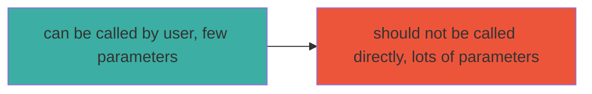
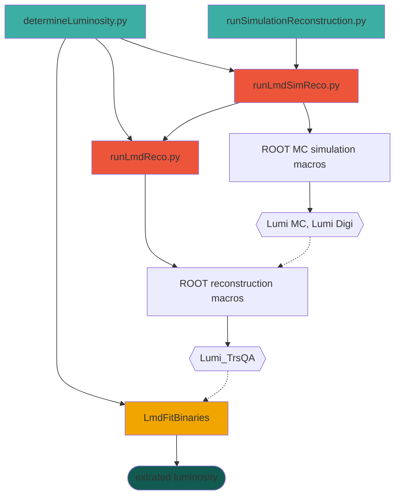
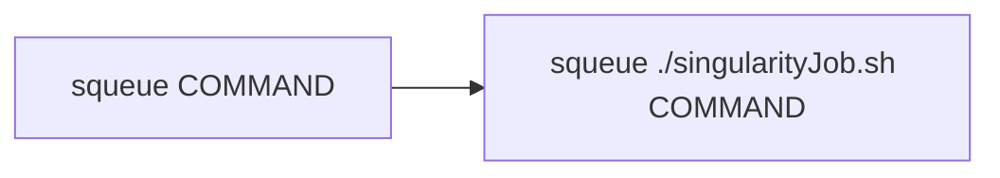

# Table of Contents

- [Table of Contents](#table-of-contents)
  - [Installation](#installation)
  - [New Version, with Docker](#new-version-with-docker)
  - [Old Version](#old-version)
    - [Prerequisites](#prerequisites)
    - [Generate Container](#generate-container)
    - [Compilation](#compilation)
    - [First Run](#first-run)
- [My First MC Simulation, Reconstruction and Luminosirt Fit](#my-first-mc-simulation-reconstruction-and-luminosirt-fit)
  - [Doing this Manually](#doing-this-manually)
  - [Details](#details)
- [Using in Container with the Slurm Agent](#using-in-container-with-the-slurm-agent)
- [Mode of Operation](#mode-of-operation)
- [Code Layout](#code-layout)
  - [Scripts](#scripts)
  - [Apps in `/bin/`](#apps-in-bin)
    - [createLmdFitData](#createlmdfitdata)
    - [createKoaFitData](#createkoafitdata)
    - [ExtractLuminosityValues](#extractluminosityvalues)
- [Singularity Wrapper](#singularity-wrapper)

## Installation

## New Version, with Docker

On a fresh system, this **should** now work:

Clone this repo:

```bash
cd ~
git clone https://github.com/panda-luminosity-detector-group/LuminosityFit.git
```

And clone PandaRoot (you need an Account for that):

```bash
cd ~
git clone https://git.panda.gsi.de/PandaRootGroup/PandaRoot.git
```

And lastly the LMD-Alignment repo:

```bash
cd ~
git clone https://github.com/panda-luminosity-detector-group/LMD-Alignment.git
```

Then, install Docker (Please see the docker docs).

Add two aliases for containers, one for `cvmfs`:

```bash
cd ~
echo "sudo alias cvmfs='docker run --rm --privileged --cap-add SYS_ADMIN --device /dev/fuse --volume /cvmfs:/cvmfs:shared --name cvmfs --ulimit nofile=1024:1024 rklasen/cvmfs'" >> .bashrc
```

and one for `lmdfit:`

*substitute my `${HOME}/LuminosityFit` to your directories!* (or leave them in the user home)

Requires paths:

| Path                                        | Function                                              |
| ------------------------------------------- | ----------------------------------------------------- |
| `${HOME}/LuminosityFit` | Path to the LMD Fit Souce code (this code right here) |
| `${HOME}/PandaRoot`     | Path to the PandaRoot source code (not compiled yet)  |
| `${HOME}/lmdfit`                    | Path for an named pipe for IPC                        |
| `${HOME}/LMD-Alignment` | Path to the LMD Alignment code (optional)             |

The other variables (`DISPLAY`, `Xauthority`, `X11-unix`) etc are needed to run ROOT TBrowsers from within the container with GUI (very helpful).

If you cloned PandaRoot and LuminosityFit to you user directory, you can just copy and paste this command:

```bash
cd ~
echo "alias lmdfit='DISPLAY=:0 xhost +local:; \
sudo docker run -u $(id -u):$(id -g) \
--net=host -it --rm \
--mount type=bind,source=${HOME}/LuminosityFit,target=/mnt/work/LuminosityFit \
--mount type=bind,source=${HOME}/PandaRoot,target=/mnt/work/PandaRoot \
--mount type=bind,source=${HOME}/LMD-Alignment,target=/mnt/work/LMD-Alignment \
-e="DISPLAY" -v="$HOME/.Xauthority:/mnt/work/.Xauthority:rw" \
-v="/tmp/.X11-unix:/tmp/.X11-unix:rw" -v /cvmfs:/cvmfs:shared \
rklasen/lmdfit:miniApr21p2'" >> .bashrc
```

Refresh the `.bashrc`:

```bash
. ~/.bashrc
```

Start the CVMFS container:

```bash
cvmfs
```

Go into the Lmd Fit Container

```bash
lmdfit
```

Compile PandaRoot:

```bash
cd PandaRoot
mkdir build
cd build
cmake ../
```

When the configuration is done, you can compile the software:

```bash
make -j16
```

Once that was successful, leave the container and enter it again, so that the updated `.bashrc` is loaded and to test if the PandaRoot build was found:

```bash
lmdfit
```

You should be greeted with:

```bash
user@user-VirtualBox:~$ lmdfit 
non-network local connections being added to access control list
Yay container!
System during compilation: Debian GNU/Linux 10 (buster)
                           x86_64
System now               : Debian GNU/Linux 10 (buster)
                           x86_64
```

Then, compile the Luminosity Fit Software:

```bash
cd ~
cd LuminosityFit
mkdir build
cd build
cmake ..
```

When the configuration is done, you can compile the software:

```bash
make -j 16
```

This may take up to 30 minutes on a reasonably modern PC, or much longer on a potato. Please feel free to get a coffee, tea, beer, or lunch.

---

The Software should now be setup. Go into the `example` dir and run the fit:

```bash
cd ~/LuminosityFit/example
../build/bin/runLmdFit -d $(pwd)/angular -c $(pwd)/fitconfig-fast.json -m 8 -a $(pwd)/resAcc -o $(pwd)/lumi-values.json
```

In the `example` dir, a new file called `lumi-values.json` should appear and contain:

```json
{
    "measured_lumi": "2666209.0536252349",
    "measured_lumi_error": "1978.9221364629209",
    "generated_lumi": "2661273.1530764317",
    "relative_deviation_in_percent": "0.18547139902182733",
    "relative_deviation_error_in_percent": "0.074359978199730711",
    "fit_converged": "true"
}
```

It should contain more or less *exactly* these values.

## Old Version

### Prerequisites

Make sure your Pandaroot environment is set up correctly, more precisely that these environment variables are set:

- SIMPATH
- VMCWORKDIR
- FAIRROOTPATH
- ROOTSYS
- LMD_DATA_DIR

Boost and the gsl library are two requirements, which are automatically included with fairsoft, so you already have them installed for sure. It is recommended to use the same boost, which was used to build the pandaroot enviroment. Use the _BOOST_ROOT_ environment variable to hint cmake to correct boost location.

```bash
export BOOST_ROOT=$SIMPATH
```

(No need to put that export in your bashrc, just run it in your shell before cmake call)

### Generate Container

You have to generate the Luminosity Fit singularity container before the software can be compiled and run.

Please see [the docker/singularity documentation](docker/README.md).

Run the following steps inside the container.

### Compilation

Simply create a build directory, change into that build directory, and run `cmake {PATH_TO_YOUR_LUMINOSITY_FIT_SOURCE}`.

**IMPORTANT!** This software works with either PandaRoot or KoalaSoft _only_. Either of these packages must be loaded prior to compilation, otherwise project-specific binaries will not be built! Use this example for PandaRoot:

```bash
. ~/PandaRoot/build/config.sh
cd ~/LuminositySoft
mkdir build && cd build
cmake ../
make -j16
```

### First Run

Simulation jobs are executed inside a Singularity container. To keep the (runtime) environment clean, all environment variables are unset in the container and have to be explicitly set. This is done via a `lmdEndFile.env`, which depends on the cluster, LmdFit installation details and used Software (PandaRoot or KoalaSoft). It must be generated only once _inside_ the Lmdfit singularity container with:

```bash
python3 genEnvVarFile.py
```

It's best if all env variables are already set.

# My First MC Simulation, Reconstruction and Luminosirt Fit

For many studies we need lots of simulation data from different boundary conditions (rest gas, misalignment and so on), automated reconstruction and luminosity fits. For these, we've included two scripts that automate almost everything in the `python` directory.

If you just want to generate simulation data, have it reconstructed and perform the lumi fit, run these (on Himster/Virgo):

```
./runSimulationReconstruction.py -e expConfig/PANDA/1.5.config
```

This script is done pretty fast, but it does submit a lot of jobs. Check on these with `squeue -u YOUR_USERNAME`. Once all are done, run:

```
./determineLuminosity.py -e expConfig/PANDA/1.5.config
```

This may take a few hours.

## Doing this Manually

If these break in the future and/or you want to do this manually, follow the [manual instructions](docs/ManualLuminosityFit.md).

## Details

The binaries in the `./bin` subdirectory of the build path can be used directly. For more convenient use, especially for larger datasamples sizes it is recommended to use the python scripts in the [./scripts](https://github.com/spflueger/LuminosityFit/tree/master/scripts) subdirectory. However, to use these scripts several environment variables have to be exported.

```bash
export LMDFIT_BUILD_PATH="path-to-your-luminosityfit-build-directory"   # e.g. $HOME/LuminosityFit/build
export LMDFIT_SCRIPTPATH="path-to-your-luminosityfit-script-directory"  # e.g. $HOME/LuminosityFit/python
export DATA_HOME="path-to-himspecf-data-storage"`
export LMDFIT_DATA_DIR=$DATA_HOME/paluma/"directory-name-of-your-choice"
```

In order to have the full ROOT cling support, export the build library directory location to the LD_LIBRARY_PATH.

```bash
export LD_LIBRARY_PATH=$LD_LIBRARY_PATH:$LMDFIT_BUILD_PATH/lib
```

# Using in Container with the Slurm Agent

Note: the agent currently needs Python 3.10 or higher. Start the agent with:

```bash
module load lang/Python/3.10.4-GCCcore-11.2.0
python/lumifit/agent.py
```

It will run in the background and wait for json-formatted `SlurmOrder`s in the named pipe `/tmp/lmdfitpipe`. After it receives an order and executes it, it returns a json-formatted `SlurmOrder` to the same pipe (and blocks if no-one receives it!).

To exit the agent, pipe the exit meta-command to the pipe:

```bash
echo '{"orderType": -1}' > $HOME/tmp/lmdfit
```

Start container (pipe in `/tmp` is automatically available in Singularity):

```bash
module load tools/Singularity
singularity run lmdfit-mini.sif
```

In there, run the test simulation:

```bash
python python runSimulationReconstruction.py simparams.conf recoparams.conf
```

# Mode of Operation

Because the Lumi Fit software is quite complex and performs a lot of steps, [the detailled mode of operation can be found here](docs/HowThisSoftwareWorks.md).

# Code Layout

This is reduced overview. For simplicity, directly user-callable scripts are teal, scripts (or binaries) that _can_ be run by a user but should not are reddish. Usually, the user-runnable scripts call these other scripts themselves:



There are only few convenience scripts and lots of "under the hood" scripts (and binaries, yellow). Rectangular nodes are scripts or programs, round nodes are data containers (like root files, json config files etc)



## Scripts

- [runSimulationReconstruction.py](docs/scripts/runSimulationRecoinstruction.md)
- [determineLuminosity.py](docs/scripts/determineLuminosity.md)
- [doMultipleLuminosityFits.py](docs/scripts/doMultipleLuminosityFits.md)

## Apps in `/bin/`

### createLmdFitData

### createKoaFitData

Same but for the Koala Experiment

### ExtractLuminosityValues

:warning: This app is deprecated and no longer needed.

Is compiled to `extractLuminosity`. Needs only a path to the merge data, and extracts the fitted lumi from the `lmd_fitted_data.root`.

```bash
./extractLuminosity /lustre/miifs05/scratch/him-specf/paluma/roklasen/LumiFit/plab_1.5GeV/dpm_elastic_theta_2.7-13.0mrad_recoil_corrected/ip_offset_XYZDXDYDZ_0.0_0.0_0.0_0.0_0.0_0.0/beam_grad_XYDXDY_0.0_0.0_0.0_0.0/no_geo_misalignment/100000/1-100_xy_m_cut_real/no_alignment_correction/bunches_10/binning_300/merge_data
```

Note: currently this doesn't seem to work because the `EstimatorOptions` aren't saved to the root file, this is a new problem.

# Singularity Wrapper

Some script parts need to be submitted to SLURM. Because the entire application only works inside the Singularity container from now on, it must be called with a special wrapper script:



The script calls the container and sources the PandaRoot/KoalaSoft config.sh scripts necessary to set the needed env variables.
