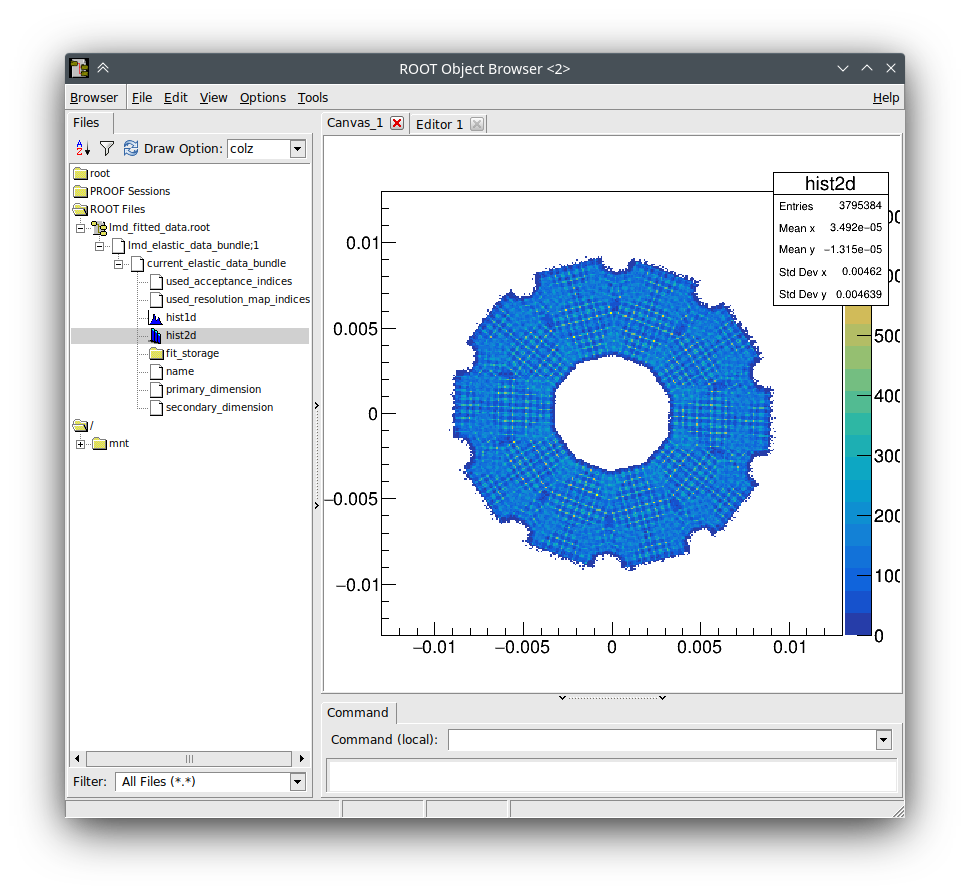
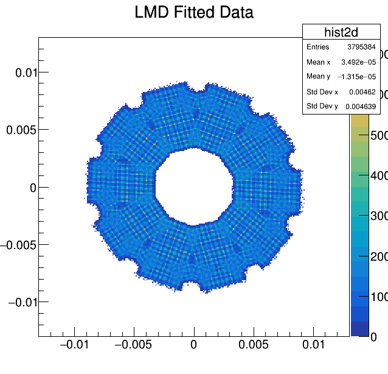
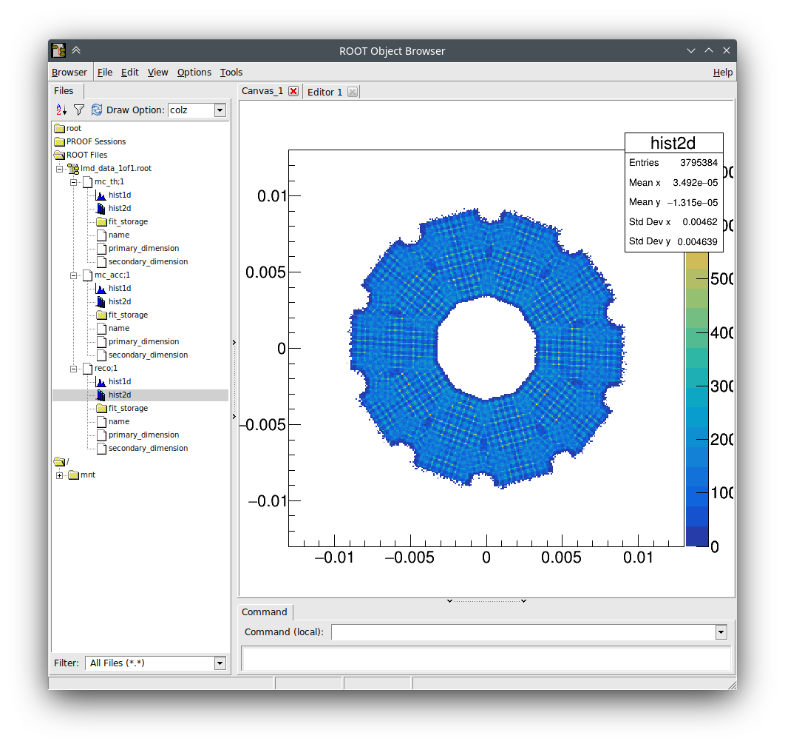
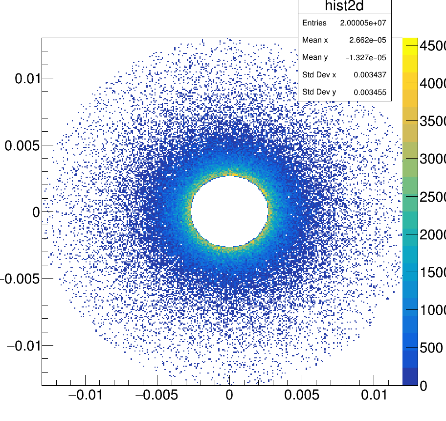
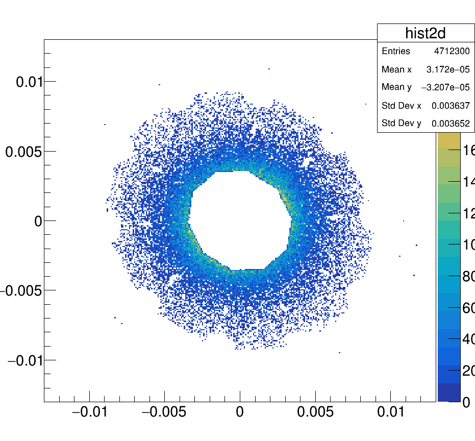

 Troubleshooting

In case the luminosity fit doesn't work or the results are unexpected, refer to this guide.

## TL;DR

- `lumi-values.json` contains fit values
- look in the `runLmdFit.log` to see if it's realistic
- look at `lmd_fitted_data`, examples below

# Fit Won't Start / Software Issues

TBD. Most software issues must be solved with tedious debugging I'm afraid.

# Fit Result is unexpected / Luminosity is too large or too small

First, we should know what values are plausible for the fitted luminosity.

## Plausible Luminosity Values

The integrated luminosity depends on the cross section of the interaction and the total number of simulated events:

$L = \frac{1}{\sigma_{\text{tot}}} \cdot N_{\text{events}}$

If the data sample is generated with the Luminosity Fit Framework (`./runSimulationReconstruction.py`), it will generate a total cross section file `elastic_cross_section.txt` the base data dir (e.g. `${LMDFIT_DATA_DIR}/plab_1.5GeV/dpm_elastic_[...]/ip_offset_[...]/beam_grad_[...]/no_geo_misalignment/100000`). It will contain the number in plain text for ease of readability.

The elastic cross section depends on the model (DPM in our case) and the angular distribution. The DPM model diverges at small scattering angles because of the coulomb part of the interaction, so the integral limits must be given. The default values are 2.7 mrad to 13 mrad.

If these limits are used and 10.000.000 events are generated, the cross sections and luminosities are:

| Beam Momentum | Lower Angle | Upper Angle | Cross Section | Generated Luminosity @ 1e7 events |
| ------------- | ----------- | ----------- | ------------- | --------------------------------- |
| 1.5 GeV       | 2.7 mrad    | 13 mrad     | 20.8549       | 4.7950e5                          |
| 15 GeV        | 2.7 mrad    | 13 mrad     | 3.38184       | 2.9569e6                          |

Keep in mind that sometimes jobs crash on the compute cluster, and instead of 10.000.000 events you may end up with only 9.900.000 events. The integrated luminosity will then be smaller accordingly!

The fitted result is typically accurate to about 1%. If the fit results deviate significantly from these numbers, something went wrong.

## Resultant Files

Remember the two subdirectories for dpm data and res/acc test data. Refer to the [Datalocations documentation](DataLocations.md) if needed.

If the fit software seemed to work and the `bunches_10/binning_300/merge_data` paths in the DPM subdirectory have been created, look inside the `merge_data` folder.

There should be several files.

## `runLmdFit.log`

- The log file for the actual luminosity fit (for example from `./determineLuminosity.py`). If this doesn't exist, the lumi fit didn't even start. Look in the agent log instead to see if the Slurm Agent successfully submitted the jobs to SLURM.

- If the software crashed, you'll see it in this log. Compile the Luminosity Fit Framework with the DEBUG build target and see where the software crashes.

- If the fit didn't converge, look at the `lmd_data_1of1.root`.

- If the fit converged, you'll see some results (example for 1e7 events @ 1.5 GeV):

> ```
> dpm_angular_1d:luminosity         = 477959       +/-  311.482
> dpm_angular_2d:tilt_x     = 1.02419e-05  +/-  1.04452e-06
> dpm_angular_2d:tilt_y     = -7.26898e-06         +/-  1.10232e-06
> ```

> :attention: Just before that, there are the Minuit2 minimization paramters of the last fit iteration. Look at these!

The Minuit2 fit results look like this:

```
Minuit2Minimizer : Valid minimum - status = 0
FVAL  = -18.9016298462902341
Edm   = 7.31274390665479216e-06
Nfcn  = 58
```

The first line indicates of Minuit thinks it landed in a valid minimum. If it didn't the fit didn't converge and we can skip directly to looking at the [data files](#lmddata1of1root).

If the `status` is `= 0`, then at least the fir converges. Next is the value of the cost function `FVAL` during the last iteration. It's negative and should be as close to 0 as possible. For a good fit, this value can be anywhere betweeen -1000 to -10. Smaller (larger negative) values usually indicate a problem. For example, this output is from a lumi fit with over 3% error:

```
Minuit2Minimizer : Valid minimum - status = 0
FVAL  = -28446.9999882550765
Edm   = 2.957320159233945e-06
Nfcn  = 65
```

The value for `FVAL` is much too small at over -28 thousand, and the fit is therefore not reliable even though it converged.

## `lumi-values.json`

If the fit converged (event to the wrong value), a resultant json file is created. This is the fit result in easily readable format. All values have a very descriptive name:

```
{
    "measured_lumi": [
        "2958081.134770026"
    ],
    "measured_lumi_error": [
        "2016.2376004325522"
    ],
    "generated_lumi": [
        "2956970.1700849244"
    ],
    "relative_deviation_in_percent": [
        "0.0375710481066375"
    ],
    "relative_deviation_error_in_percent": [
        "0.06818592966646822"
    ]
}
```

Don't ask why the actual values are strings and not floats, which json would also support. Nobody knows, and at this point everybody is too afraid to ask (and a lot of code would have to be re-written). Also, in older versions the values are in a list (these suqare brackets `[]`), but that's not necessary anymore.

## `lmd_fitted_data.root`

> :warning: Look at the 2D histogram!

This contains a serialized instance of the `PndLmdFitDataBundle` after the fit. That means the C++ object was written to the ROOT file and be read out again (must be cast to `PndLmdFitDataBundle` by hand though). Inside, there is an elastic data bundle that inherits from some other classes and contains a 2D Histogram. That is important.

In a TBrowser, it should look like this (for 15.0 GeV):



You should clearly see the detector acceptance:
- clearly defined inner hole
- clearly defined outer shape due to sensor shapes
- little gaps inside from missing sensor acceptance (lumi is built this way, that's normal)
- x/y axes are some theta angle parametrization, details are not important. only the intensity distribution is important.

Again, in large:



If the lumi fit data looks different from this, it is likely wrong.

### Beam Momentum Dependence

Attention! Because of the 40mrad beam kink, the image will look distored at lower beam momenta. This is what it looks like at 1.5 GeV


And this at 4.06 GeV:


If your results look completely different, look inside the `lmd_data_1of1.root`.


## `lmd_data_1of1.root`

The `lmd_data_1of1.root` contains the merged resolution and acceptance calculations. That's why it's in the `merge_data` folder. It contains the data that is used by the fit and two histograms, which indicate if the resolution and acceptance calculations were successful.

It looks like this in a `TBrowser`:



The 2D histogram of the `reco` class should look almost like the successful lmd fit histogram (including resolution smearing which results in these Moiree-like patterns):


If it doesn't, check the `mc_th` and `mc_acc` histograms.

The `mc_th` histogram is the reconstructed theta angle distribution, so it should be our basic DPM model data. Much data at the very center and a decreasing amount of data further away from the beam axis. It should be uniform in phi (around the beam axis):


> :warning: Attention! Since the acceptance data depends on the angular distribution of theta, this must `mc_th` data be correct. Otherwise, the acceptance will be wrong and the fit will also be wrong.

The `mc_acc` is the reconstructed detector acceptance. Apart from some strays it should be the ideal projection of the detector geometry, *without* resolution effects (these Moiree-like patterns visible in the lmd fit histograms). Since it's a reduction of the `mc_th` data *by* the acceptance, any patterns visible in the `mc_th` data must *also* be visible in the `mc_acc` data (but uniformity pretty much always looks the same):


### Examples for wrong Angular Distributions

Here the RNG wasn't setup properly, resulting a each of the 100 datasets containing identical data:



As a result, the accecptance is also wrong:



Here, the maximum phi angle was set incorrectly, so that onlt tracks were only genereated in a small phi segment: