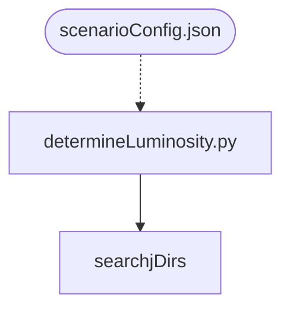
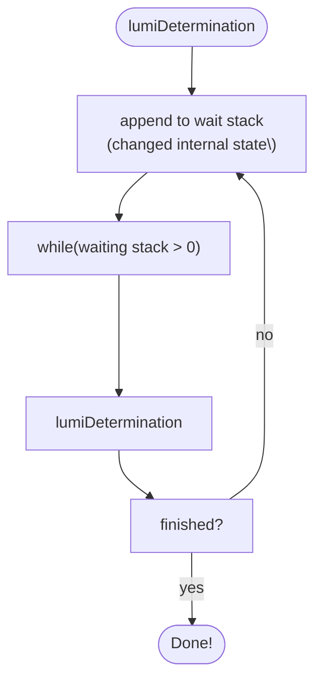
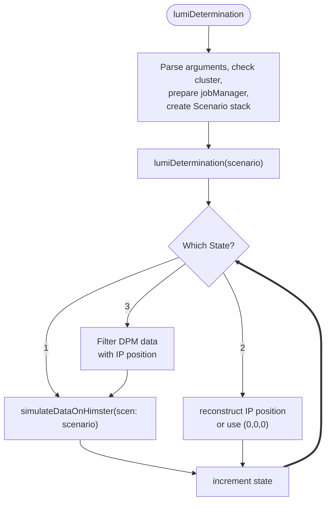
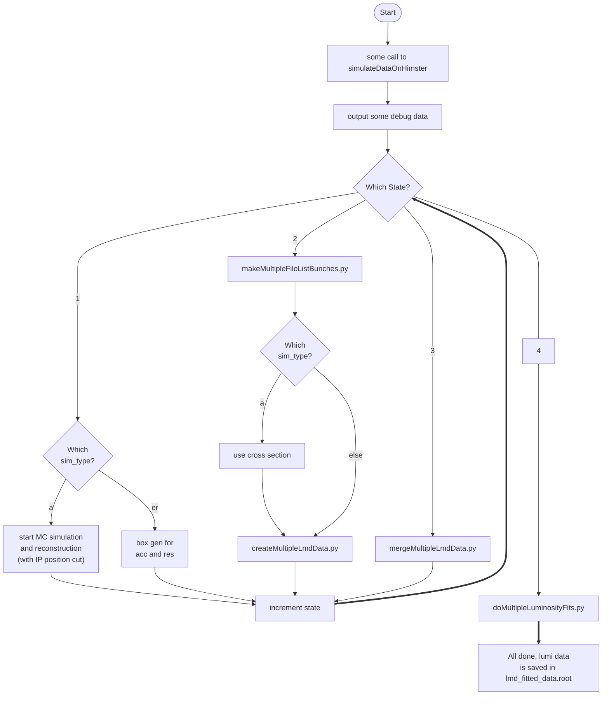

# The `determineLuminosity.py` Script

Can only be run if `LumiTrkQA_` files for PandaRoot or `Koala_Track_` files for KoalaSoft are already present.

Minimum run example works without arguments, but searches a LOT of directories. It's generally better to at least limit the search paths:

```bash
./determineLuminosity.py --base_output_data_dir /path/to/TrksQAFiles.root
```

# Run Sequence

Luminosity Determination involves a lot of steps. Each of them is detailled in this section:

- Dertermine interaction point from reconstructed tracks
- Do Data Reconstruction again (with IP position cut)
- Perform box sim for acceptance and resolution data
- Create multiple LMD data
- Merge multiple LMD data
- Perform Luminosity Fit on Merged Data

## Diagram

The run sequence is as follows:



# Functions

- `lumiDetermination()`
- `simulateDataOnHimster(scen: scenario)`

## Call Diagram

The function diagram is pretty complicated, and has lot's of internal states. One very important class of objects is the `scenario` class, which holds a `state` variable (and a list with more states and working directories). This class is in `scenario.. These variables controls the program flow. There can be multiple `scenario`s, each with their own `state`. A scenario object ist also passed to the `simulateDataOnHimster(scen: scenario)` function.



## `lumiDetermination()`

The `lumiDetermination` function is called once at the beginning, and then sometimes again if the waiting stack is not empty.



## `simulateDataOnHimster(scen: scenario)`

It also has an internal `state` variable that determines its behavior.


